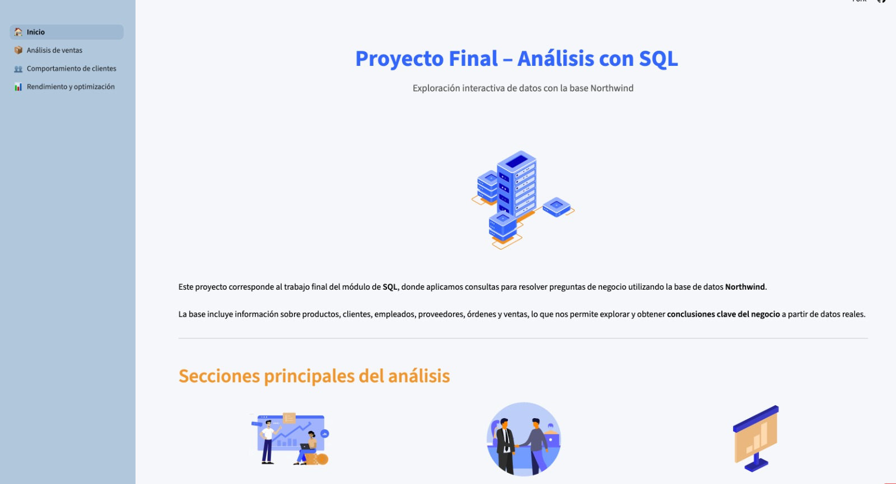

# ¡Hola, soy Isabella Martín! 👋

Soy estudiante de Ingeniería en Ciencias de la Computación en ESPOL y me apasiona el análisis de datos, la programación y el diseño de software. He trabajado en proyectos que abarcan desde la creación de aplicaciones interactivas hasta la implementación de patrones de diseño en sistemas de gestión.

## 📂 Proyectos

### 1. [Análisis Interactivo de la Base de Datos Northwind](https://github.com/isabellaim/ProyectoModulo2)
   - **Descripción**: Este proyecto simula las operaciones de una empresa de distribución usando la base de datos Northwind. A través de una aplicación web desarrollada con Streamlit, puedes visualizar KPIs clave, filtrar datos y revisar consultas SQL optimizadas.
   - **Tecnologías utilizadas**: Streamlit, MySQL, Pandas
   - **Estado**: Completo
   - **Captura de pantalla**:
     

### 2. [Sistema de Administración de Ferias](https://github.com/isabellaim/POO-P03-G04)
   - **Descripción**: Un sistema desarrollado con Java y CSS que permite la administración de ferias, emprendedores, auspiciantes y stands. Utiliza buenas prácticas de programación y manejo de archivos serializados.
   - **Tecnologías utilizadas**: Java, CSS
   - **Estado**: Completo

### 3. [Patrones de Diseño y UML](https://github.com/isabellaim/G04-PatronesDise-oUML)
   - **Descripción**: Implementación de los patrones de diseño **Iterator**, **Strategy** y **Chain of Responsibility** en un sistema de gestión de inventarios y distribución de productos para una empresa de tecnología.
   - **Tecnologías utilizadas**: Java, UML, Patrones de Diseño
   - **Estado**: Completo

### 4. [Tic Tac Toe VR](https://github.com/Jmuniz27/ProyectoMatDisc--Tic-Tac-Toe-With-Trees)
   - **Descripción**: Un juego de Tic Tac Toe que utiliza árboles, estructuras de datos y conceptos de matemáticas discretas en Python. Implementa OpenCV para el reconocimiento de imágenes y filtros de realidad virtual para una experiencia inmersiva.
   - **Tecnologías utilizadas**: Python, OpenCV, VR
   - **Estado**: Completo

---

## 🛠️ Tecnologías y Herramientas

Durante mi carrera he trabajado con diversas tecnologías y herramientas que me han permitido llevar a cabo mis proyectos:

- **Lenguajes de programación**: Python, Java, SQL
- **Frameworks y herramientas**: Streamlit, MySQL, Pandas, OpenCV, JavaFX
- **Bases de datos**: MySQL, FreeSQLDatabase
- **Patrones de diseño**: Iterator, Strategy, Chain of Responsibility
- **Herramientas de desarrollo**: Git, GitHub, UML
- **Otros**: Virtual Reality (VR)

---

## 📧 Contacto

- **Correo institucional**: [iimartin@espol.edu.ec](mailto:iimartin@espol.edu.ec)
- **LinkedIn**: [Enlace a mi perfil de LinkedIn](www.linkedin.com/in/isabellamartinp)

---

## 🎓 Educación
  **Cursos relevantes tomados**: Bases de Datos, Estructuras de Datos, Álgebra Lineal, Matemáticas Discretas, Diseño de Software, Interacción Humano Computador

---
